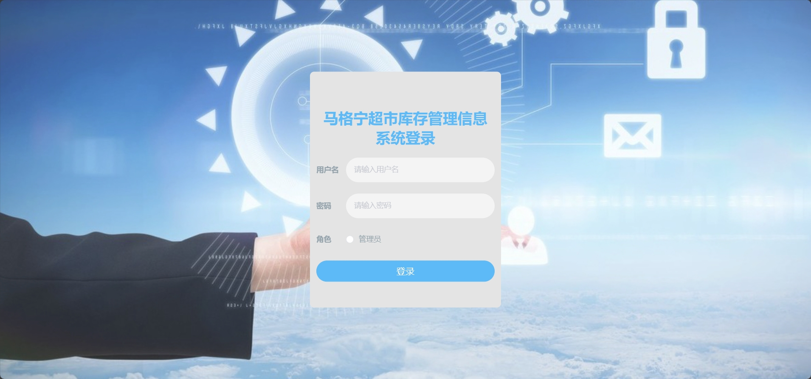
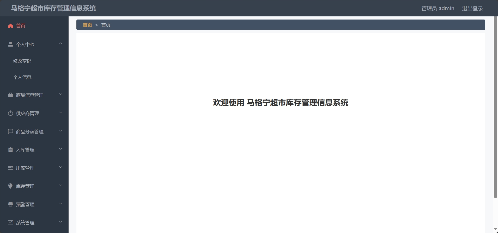
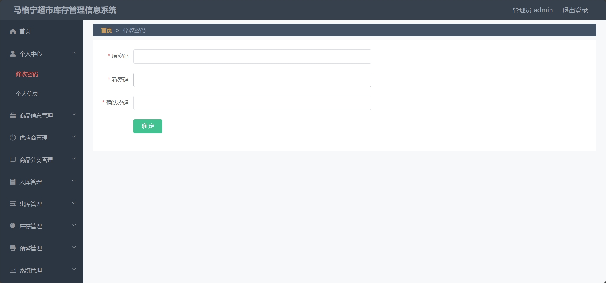
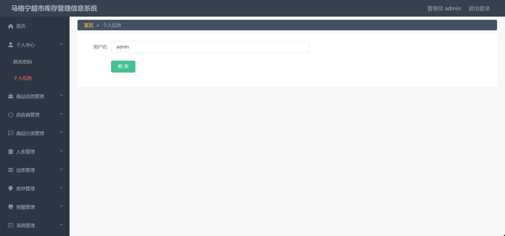
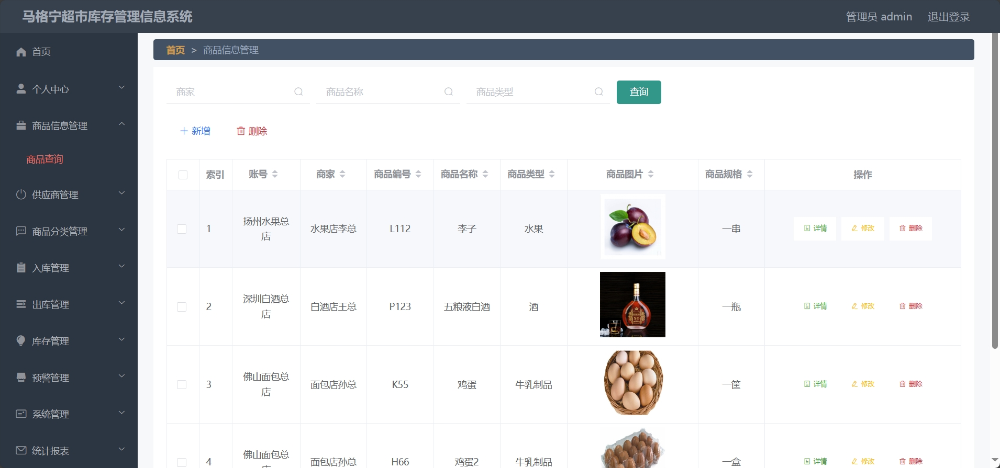
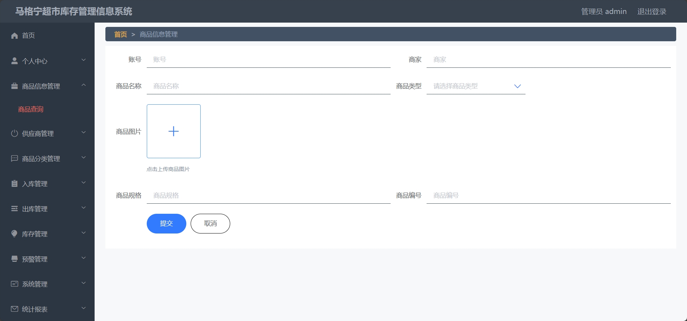
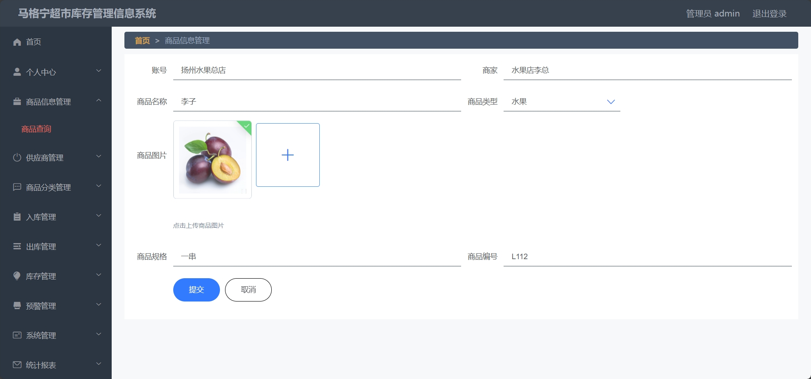

<h1 align="center">基于SSM框架的库存信息管理系统</h1>

 获取sql文件 QQ: 605739993 QQ群: 377586148 

 [个人站点: 从戎源码网](https://armycodes.com/)

## 简介

> 本代码来源于网络,仅供学习参考使用!
>
> 提供1.远程部署/2.修改代码/3.设计文档指导/4.框架代码讲解等服务
>
> 前端地址：http://localhost:8081/#/login
>
> 管理员: admin 密码: 123456

## 项目介绍

基于SSM框架的库存信息管理系统：前端 微信小程序、ElementUI、Vue，后端 SpringMvc、Mybatis，系统角色分为：管理员，管理员在管理后台物品信息，对物品种类进行管理等。主要功能如下：

### 启动方式

- 前端：
> 按钮启动 | 启动Tomcat
>
> cd src/main/webapp/admin
> 
> npm install
> 
> npm run dev

- 后端：
> 按钮启动 | 启动Tomcat

### 管理员：

- 基本操作：登录、修改密码、获取个人信息、修改个人信息
- 商品信息管理：获取商品信息列表、查看商品详情、修改商品信息、删除商品信息、筛选商品信息、新增商品
- 供应商管理：获取供应商列表、查看供应商详情、修改供应商信息、删除供应商信息、筛选供应商信息、新增供应商
- 商品分类管理：获取商品分类信息列表、修改商品分类信息、删除商品分类信息、筛选商品分类信息、新增商品分类
- 入库管理：获取入库信息、查看入库详情、修改入库信息、删除入库信息、筛选入库信息、商品入库
- 出库管理：获取出库信息、查看出库详情、修改出库信息、删除出库信息、筛选出库信息、商品出库
- 库存管理：获取商品库存信息、盘点库存、筛选商品库存信息、库存盘点查询
- 预警管理：滞销告警查询、上下限告警查询
- 系统管理：新增用户、删除用户、筛选用户、查看用户信息详情、修改用户信息、查看系统日志

## 环境

- <b>IntelliJ IDEA 2020.3</b>

- <b>Mysql 5.7.26</b>

- <b>Tomcat 9.0.41</b>

- <b>NodeJs 14.17.3</b>

- <b>Maven 3.6.3</b>

- <b>JDK 1.8</b>

## 运行截图

